# Getting Started with the Red Team Assessment Platform (RTAP)

This guide walks through the first workflow after you launch the application. Follow the steps in order so operations have the context they need for accurate analytics. The README already covers installing dependencies and starting the app.

## 1. Prepare Your Taxonomy

- Open Settings -> Taxonomy and customize each section to your liking.
- Required to record defensive outcomes:
  - Tool categories. Examples: EDR, SIEM, IDS, IPS, etc. You may wish to include "Human Being" to capture manual responses.
  - Tools. Examples: CrowdStrike Falcon, Splunk, Metasploit, Sliver, etc. These are classified as defensive or offensive. Offensive tools are optional but defensive tools are required for recording detection and prevention outcomes.
  - Log Sources. Examples: Sysmon, Windows Event Logs, etc. These are used for recording attribution outcomes.
- Optional:
  - Threat Actors. You can enter them manually or use the import option to pull in techniques directly from MITRE ATT&CK.
  - Targets. Examples: Production DB, Source Code Repo, etc. Optionally, specify which are "crown jewels".
  - Tags. Examples: Stealth, Purple Team, etc. These can be applied to operations and used for filtering lists analytics.

  <a href="images/taxonomy.png">
    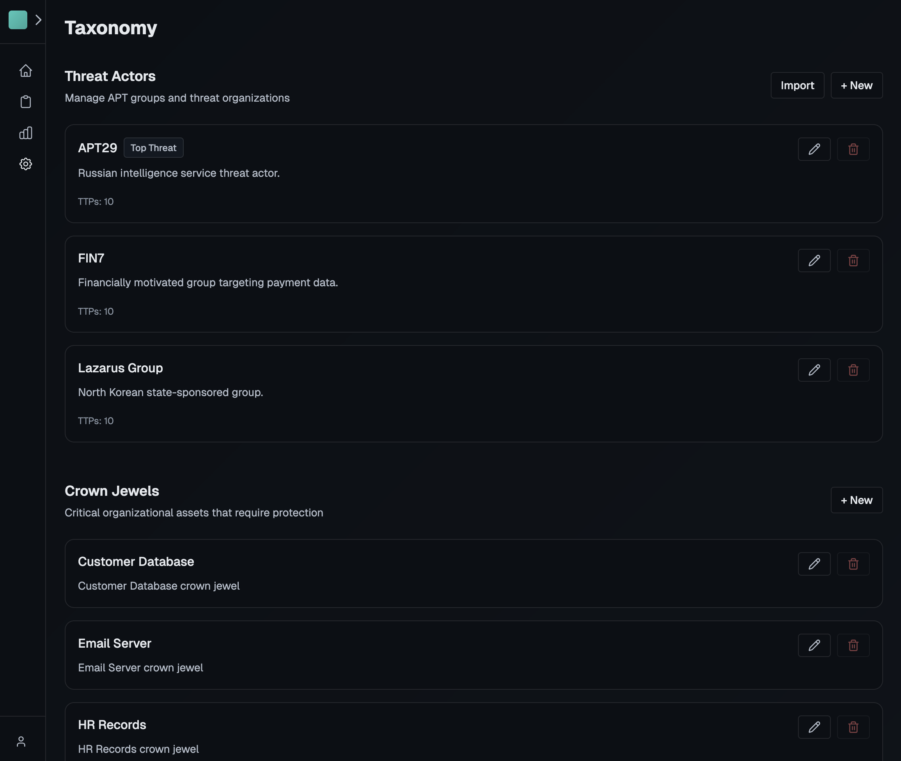
  </a>

## 2. Add Users and Groups

- Go to Settings -> Users to create additional logins.
- Assign each user the appropriate role:
  - Admin: Full platform access, including settings
  - Operator: Read/Write access to operations, view analytics, cannot access settings
  - Viewer: Read access to operations and analytics, cannot access settings
- Create groups under Settings -> Groups if you plan to restrict operations to specific teams.
- When SSO is enabled, every user still needs to exist in RTAP ahead of time with the correct role and group membership.

## 3. Create an Operation

- Navigate to Operations and click New.
  - Blank operation: create from scratch
  - From threat actor: imports the techniques from taxonomy definitions of threat actors
  - From MITRE campaign: imports the techniques from a MITRE ATT&CK campaign
- Provide the name, description, status
- Set the start and end dates. These dates drive analytics such as trends and duration metrics, so keep them accurate.
- Optionally, configure tags, crown jewels, threat actor being emulated, and group access restrictions.

  <a href="images/new-operation.png">
    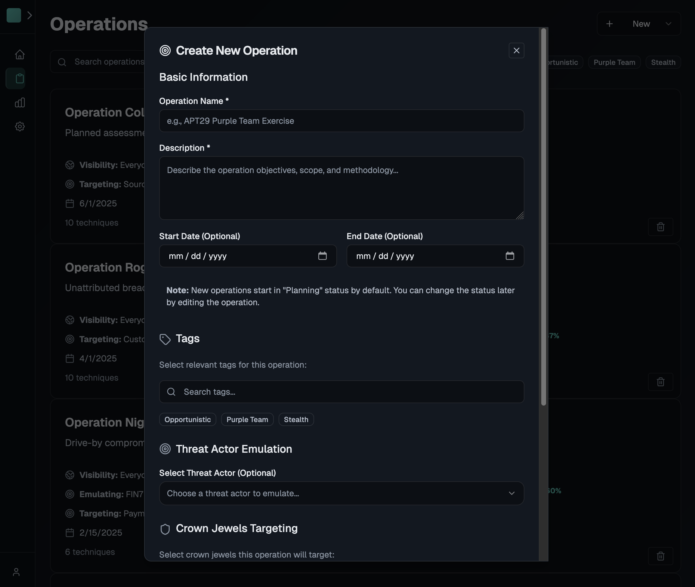
  </a>

## 4. Plan Attack Techniques

- Inside the operation, open the Techniques tab and add a technique. When planning, you only need to fill in the overview. You can come back and add detail as the operation progresses.
- Overview tab:
  - Use the Tactic/Technique pickers to choose from the catalog
  - Fill in an optional description
- Execution tab:
  - Timing, execution details, offensive tooling, and assets compromised
- Outcomes tab:
  - Was the technique detected, prevented, or attributed later during IR?
  - What tooling and log sources were involved in successful outcomes or SHOULD HAVE BEEN involved in failed outcomes?
  - Note: You can leave an outcome as "N/A" and it will not be graded as failed in analytics. Do this for things that realistically cannot be detected/prevented/attributed.

  <a href="images/technique-editor.png">
    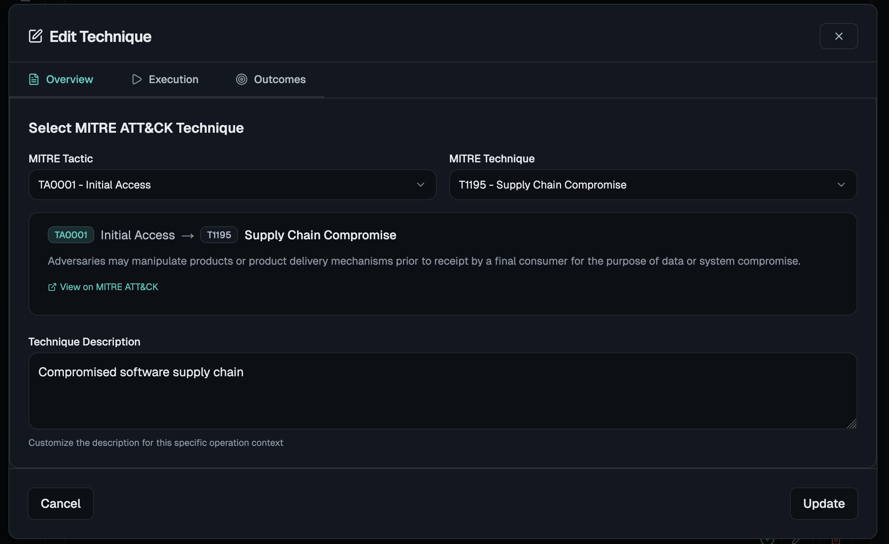
  </a>

## 5. Review Attack Visualizations Inside the Operation

### Attack Matrix - Operation View

This view shows an attack matrix specific to the operation. You can maximize the view to fill your browser, expand or hide sub-techniques, and toggle visibility of the operation across the entire ATT&CK matrix.

Success metrics are displayed on each technique card.

  <a href="images/operation-matrix.png">
    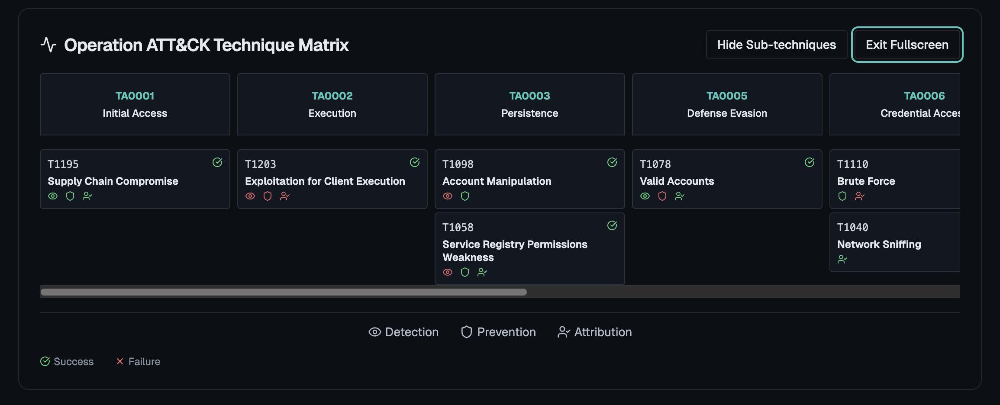
  </a>

### Attack Flow

This is an interactive flow chart built automatically from the operation's techniques. Because attacks don't always follow a logical order, you can edit this flowchart and save any changes you make. This includes dragging to re-arrange cards, deleting connection points, and creating new ones. You can also click "Reset Layout" to start from the auto-generated chart.

Success metrics are displayed on each technique card.

  <a href="images/attack-flow.png">
    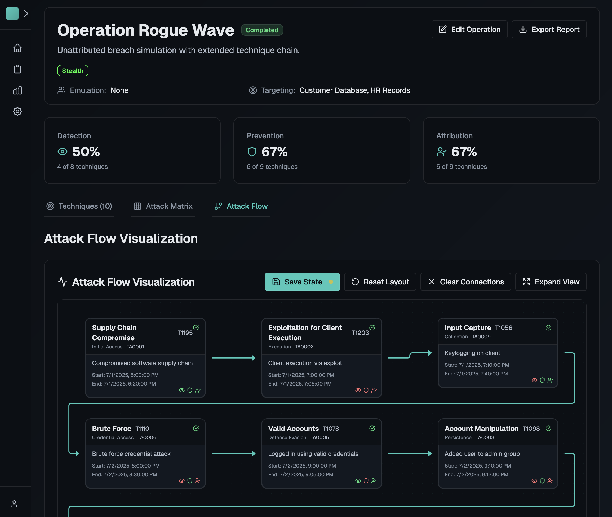
  </a>

### Attack Timeline

This is a gantt chart that displays horizontal bars for attack technique execution timelines. Hovering over individual techniques will display additional detail, including defensive outcomes.

  <a href="images/attack-timeline.png">
    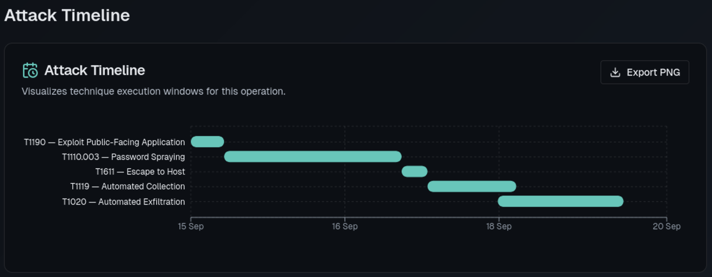
  </a>

## 6. Explore Analytics

- Analytics -> Scorecard for high-level effectiveness metrics. Filters at the top limit results by date range and tags.
- Analytics -> Attack Matrix to compare executed coverage across all accessible operations. Toggle to view against the complete ATT&CK matrix. Metrics are displayed on each individual technique card.
- Analytics -> Trends to track performance over time. Filters at the top limit results by date range and tags.

  <a href="images/scorecard-1.png">
    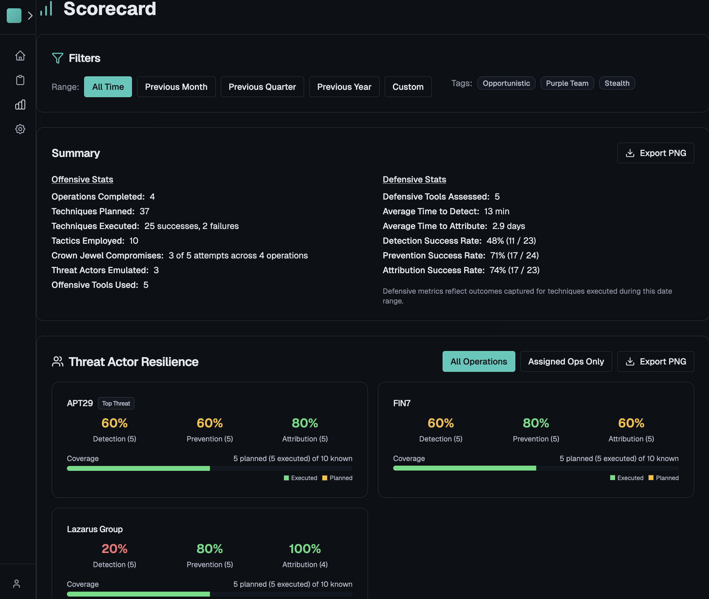
  </a>

  <a href="images/scorecard-2.png">
    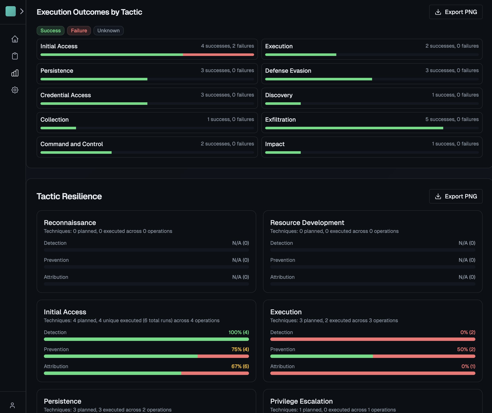
  </a>

  <a href="images/scorecard-3.png">
    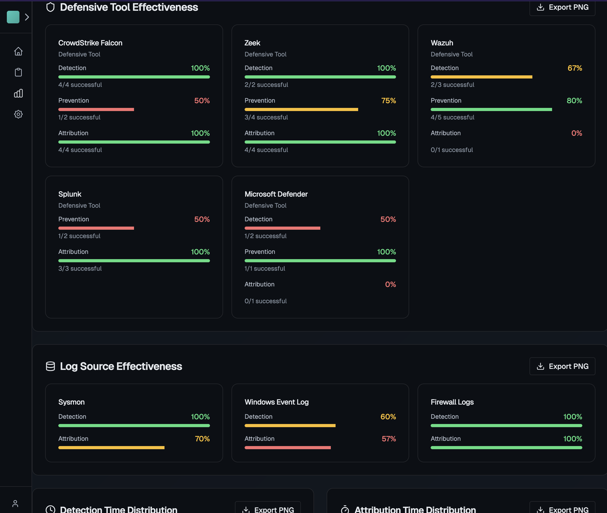
  </a>

  <a href="images/trends-1.png">
    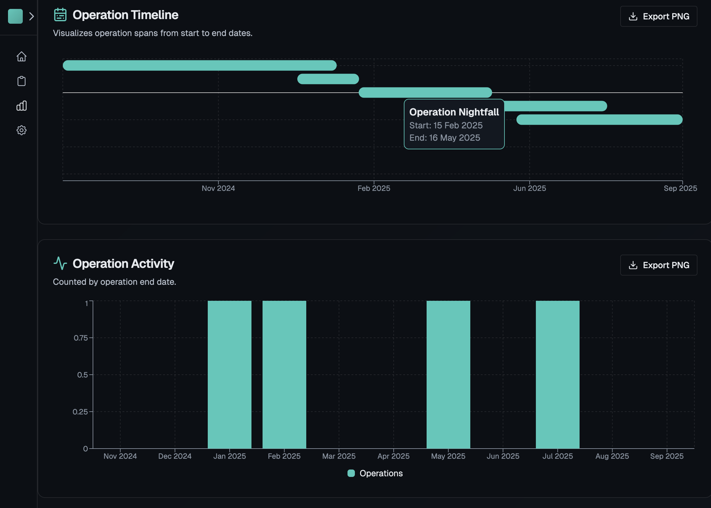
  </a>

  <a href="images/trends-2.png">
    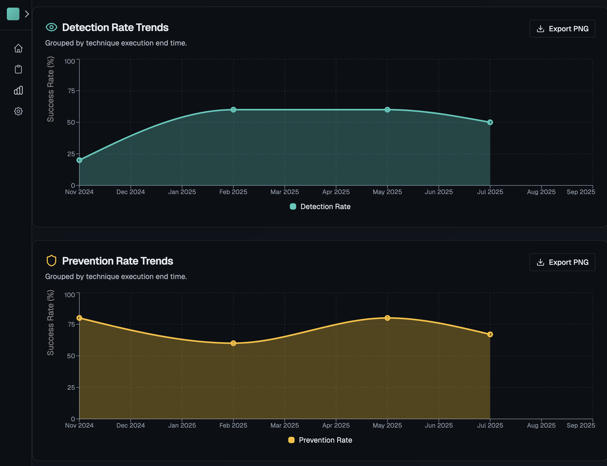
  </a>

